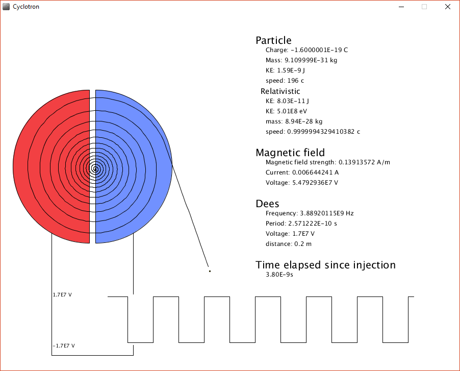

# Cyclotron
Numerical simulation of a cyclotron. Uses classical machanics and the euler method to simulate a charged particle being accelerated by a cyclotron.
No relativistic considerations are made in the simulation. The relativistic data is only there for show.

